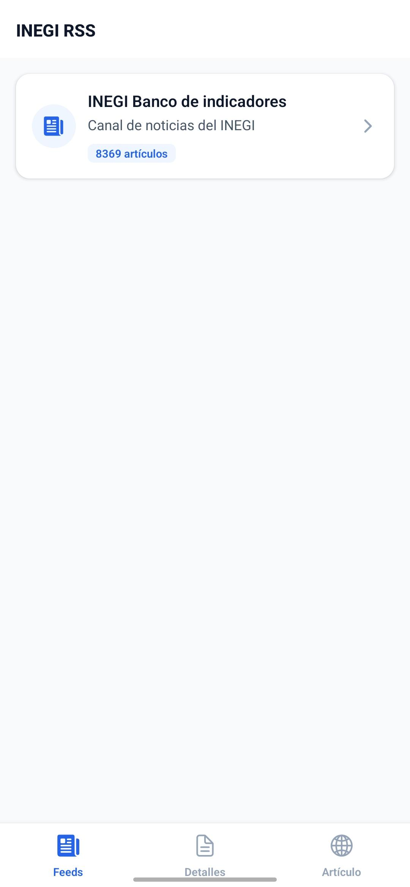
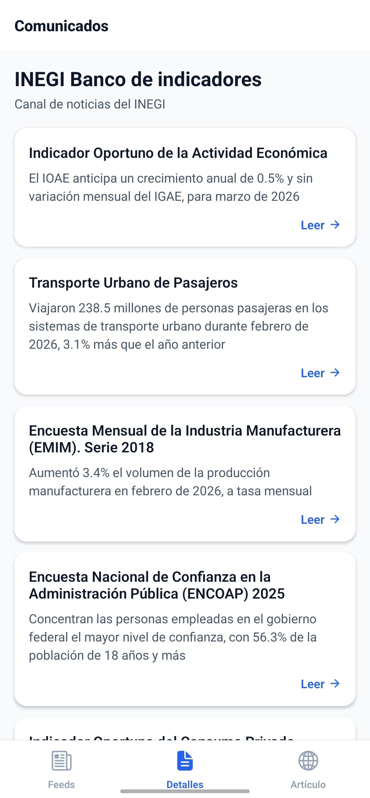
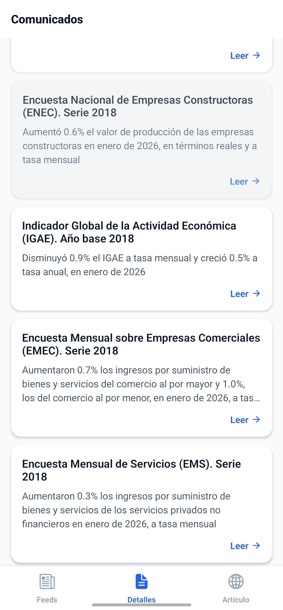
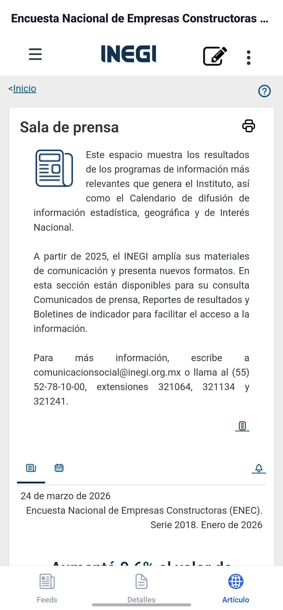
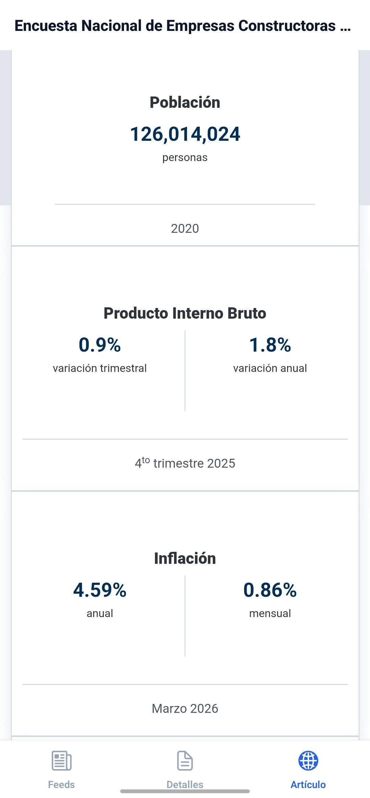

# 📰 PulseReader

<div align="center">
  
  
  
  
  
</div>

<br />

<div align="center">


</div>

> ⚠️ **Requirement:** This project requires **Expo SDK 55**. Ensure your Expo Go version supports it.

Welcome to the **PulseReader** repository. This is a cross-platform mobile application built with React Native and Expo, designed to fetch, parse, and display RSS feeds. By default, it retrieves official press releases and news from INEGI (Mexico's National Institute of Statistics and Geography).

---

## 📚 About The Project

| Feature | Details |
| -------- | ------- |
| 🎯 **Purpose** | A mobile RSS reader to browse feeds, read summaries, and open full articles. |
| ⚙️ **Architecture** | Built with React Native and Expo using TypeScript. |
| 💾 **State Management** | Uses Redux Toolkit for global state and async data handling. |
| 🔄 **Core Operations** | Fetch XML data, normalize tags, parse RSS content, and navigate through tabs. |

---

## 🔧 Highlighted Features


| Feature | Description |
|--------|------------|
| **XML Preprocessing** | Normalizes non-standard tags (`<row>` → `<item>`) before parsing. |
| **In-App Browser** | Uses WebView to open articles inside the app. |
| **Async State Handling** | Manages loading and error states with Redux extraReducers. |
| **Tabbed Navigation** | Bottom tabs with Ionicons for navigation. |

---


## 🛠️ How to Run Locally

### 1. Clone the repository
```bash
git clone https://github.com/MexboxLuis/PulseReader.git
cd PulseReader
```

### 2. Install dependencies
```bash
npm install
```

### 3. Start Expo
```bash
npm start
```

### 4. Run the app
- Press **s** → switch to Expo Go mode
- Scan QR with Expo Go
- Or:
  - Press **a** → Android emulator
  - Press **i** → iOS simulator

(Expo Go must support SDK 55)


### ⚠️ If it does not connect
```bash
npx expo start --tunnel
```

### ⚠️ Expo Go version mismatch

If the app does not open in Expo Go:

- Update Expo Go from the Play Store  
- Or install a compatible version from: https://expo.dev/go

